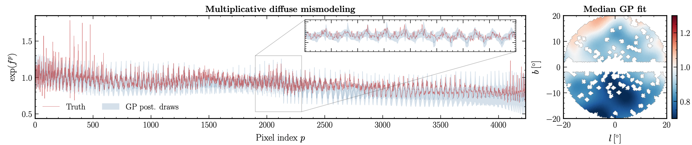

# Semi-parametric γ-ray modeling with Gaussian processes and variational inference

[Siddharth Mishra-Sharma](mailto:sm8383@nyu.edu) and [Kyle Cranmer](mailto:kyle.cranmer@nyu.edu)

[](https://arxiv.org/abs/2010.10450)
[](https://opensource.org/licenses/MIT)



## Abstract 

Mismodeling the uncertain, diffuse emission of Galactic origin can seriously bias the characterization of astrophysical gamma-ray data, particularly in the region of the Inner Milky Way where such emission can make up over 80% of the photon counts observed at ~GeV energies. We introduce a novel class of methods that use Gaussian processes and variational inference to build flexible background and signal models for gamma-ray analyses with the goal of enabling a more robust interpretation of the make-up of the gamma-ray sky, particularly focusing on characterizing potential signals of dark matter in the Galactic Center with data from the Fermi telescope.

## Code

### Dependencies

The code dependencies are given in [environments.yml](environment.yml).

### Running experiments 

The `inference.constructor.ModelConstructor` class creates simulated _Fermi_ data and instantiates a `GPyTorch`/`Pyro` model for GP inference. The `inference.trainer.PyroSVITrainer` class is used for training.

The following instantiates these classes and reproduces the experiments used for the paper:
```
python train.py --guide_name MVN --num_inducing 200 --poiss_only
python train.py --guide_name IAF --num_inducing 200 --poiss_only
python train.py --guide_name ConditionalIAF --num_inducing 200 --poiss_only
```
where the `--guide_name` option specifies different variational distributions that can be used for the template parameters:
- `MVN`: Multivariate normal guide, models template parameters as correlated Gaussians.
- `IAF`: Uses an [inverse autoregressive flow](https://arxiv.org/abs/1606.04934) to model template parameters.
- `ConditionalIAF`: Uses an [inverse autoregressive flow](https://arxiv.org/abs/1606.04934) conditioned on summary statistics of the Gaussian process draws (see paper for more information).

These variational guides are defined in [models/template_param.py](models/template_param.py).

[notebooks/fermi-gp-poiss.ipynb](notebooks/fermi-gp-poiss.ipynb) can be used to analyze the runs and also run inference interactively in a notebook. See [inference/constructor.py](inference/constructor.py) for a list of configurable parameters.
### Non-Poissonian regression 

Removing the `--poiss_only` option runs a [non-Poissonian template fit](https://arxiv.org/abs/1612.03173). **This is untested.** A stand-alone, differentiable version of the non-Poissonian likelihood can be found in [models/likelihoods.py](models/likelihoods.py).

## Citation

This code is associated with the paper:
```
@inproceedings{Mishra-Sharma:2020kjb,
    author = "Mishra-Sharma, Siddharth and Cranmer, Kyle",
    title = "{Semi-parametric $\gamma$-ray modeling with Gaussian processes and variational inference}",
    booktitle = "{Third Workshop on Machine Learning and the Physical Sciences (NeurIPS 2020)}",
    eprint = "2010.10450",
    archivePrefix = "arXiv",
    primaryClass = "astro-ph.HE",
    month = "10",
    year = "2020"
}
```

The repository borrows data products and code from [NPTFit](https://github.com/bsafdi/NPTFit) ([paper](https://arxiv.org/abs/1612.03173)), and heavily relies on [Pyro](https://arxiv.org/abs/1810.09538), [GPyTorch](https://arxiv.org/abs/1809.11165), and [PyTorch](https://github.com/pytorch/pytorch/blob/master/CITATION).